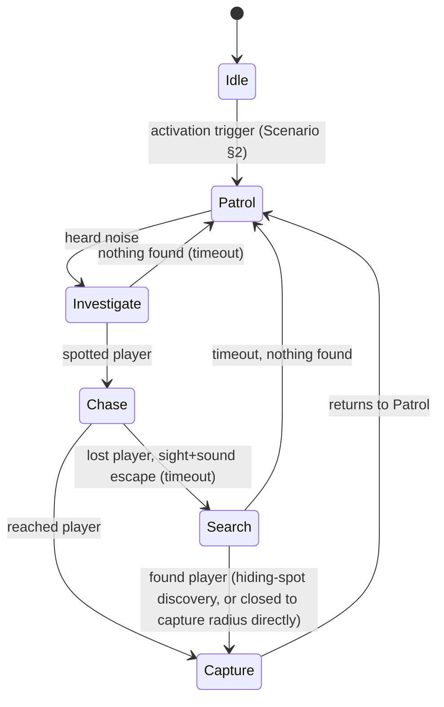

# AI_SYSTEM — KATPUTALI

Full behavioral and technical spec for Putli, the game's sole enemy AI. Design intent and lore in [[CHARACTERS]] §2 and [[STORY]] §3; how the player experiences this in [[GAMEPLAY]] and [[GAME_MECHANICS]] §3.

## 1. Design Goals

- **Fair:** the player can always reason about risk from audio alone (see §7).
- **Legible:** state changes are always accompanied by a distinct audio and/or animation tell — no silent instant-chase.
- **Cheap to implement and debug:** a single finite state machine (FSM), no machine learning, no complex pathfinding beyond a navmesh — appropriate for a solo dev on PlayCanvas (see [[TECH_STACK]], [[CODING_RULES]]).

## 2. State Machine

**Diagram correction:** the original draft of this diagram labeled the Search→Capture edge "timeout," which contradicted the Search prose below (timeout goes to Patrol) and Capture's own prose (triggered by closing distance, not by a timer). Fixed above — Search→Capture fires on a successful hiding-spot discovery roll (§4) or if Putli otherwise closes to capture radius of the player while searching, exactly like Chase→Capture; Search→Patrol is the timeout path.

- **Idle:** only active during the opening grace period (see [[SCENARIO]] §1). No sensors active.
- **Patrol:** follows a weighted-random patrol loop (see [[LEVEL_DESIGN]] §8). Both hearing and sight sensors active (§3). Emits the constant wood-creak/*ghungroo* audio tell (see [[AUDIO]]).
- **Investigate:** triggered by a heard-but-unseen noise event. Moves to the noise's last known position, pauses, plays a distinct "listening" animation/audio beat, then returns to Patrol if nothing found within a timeout.
- **Chase:** triggered by the sight sensor acquiring the player, or by Investigate directly spotting the player. Moves at chase speed (faster than patrol) directly toward the player's current tracked position. Ends if the player breaks both sight and sound detection for a sustained duration → transitions to Search.
- **Search:** moves to the player's last known position, then checks a small number of nearby hiding spots (weighted by proximity) with a per-spot chance to find the player (see [[GAME_MECHANICS]] §3). Also transitions straight to Capture if Putli closes to capture radius of the player during the search (e.g. the player didn't hide at all). Times out back to Patrol if unsuccessful.
- **Capture:** triggered when Chase or Search closes distance to a fixed capture radius, or Search's hiding-spot discovery succeeds. Non-interactive short sequence, then hands off to the capture/struggle system (see [[GAME_MECHANICS]] §4). Always returns to Patrol afterward, never directly re-enters Chase (see grace period, [[GAME_MECHANICS]] §4).

## 3. Sensors

- **Hearing:** a radius-based check against the player's current noise-emission value (crouch/walk/sprint/trap-trigger — see [[GAME_MECHANICS]] §3), recalculated on player movement-state change and on discrete noise events (dropped items, floor traps). Occluded by closed doors (reduced radius) but not by open doorways.
- **Sight:** a forward cone (angle + range, data-driven per [[DATA_MODEL]] §4) raycast-checked against the player's position, respecting full occlusion from walls/closed doors and partial occlusion from *jaali* screens (reduced detection chance rather than a binary block — see [[PHYSICS]] §3).
- Both sensors are evaluated on a fixed low-frequency tick (e.g. every 150–200ms, not every frame) for performance headroom — see [[PERFORMANCE]] §4.

## 4. Search Behavior Detail

On entering Search, Putli evaluates the 1–2 nearest hiding spots to the player's last known position (from [[LEVEL_DESIGN]] §7) and, if the player is actually hiding in one of them, applies a data-driven discovery chance rather than an automatic find. This keeps hiding a genuine risk-reduction tool (per [[GAME_MECHANICS]] §3) without making it either useless or a perfect safe room.

## 5. Patrol Route Logic

Three overlapping named loops — *Courtyard–Ground*, *Courtyard–Upstairs*, *Courtyard–Basement* — each a sequence of waypoints on the level navmesh (see [[LEVEL_DESIGN]] §8, [[PHYSICS]] §2). On completing a loop, Putli re-rolls a weighted-random choice of which loop to run next (Courtyard legs are weighted higher, since it's the hub — keeps average time-to-encounter roughly even across floors, validated per [[TESTING]] §4).

## 6. Difficulty Scaling

All sensor radii, Chase/Patrol speed, Investigate/Search timeout durations, and hiding-spot discovery chance are pulled from the active difficulty preset's config block (see [[GAME_MECHANICS]] §7, [[DATA_MODEL]] §4) — no code branching per difficulty, purely data-driven, so tuning during playtesting never requires a rebuild of AI logic.

## 7. Deliberate Fairness/Transparency Choices

- No minimap or enemy-position UI element exists (see [[GAMEPLAY]] §5) — but every state has an audio signature (see [[AUDIO]] §2) so a player who listens is never blindsided "for free." This is a design contract: any new Putli behavior added later must ship with an audio tell.
- Sight cone never detects through full-occlusion geometry, even at close range — no "aimbot" detection.
- Chase speed is tuned to be only marginally faster than player sprint (see [[DATA_MODEL]] §4), so pure sprinting away is a valid (if noisy and stamina-limited) escape option, not a guaranteed loss.

## 8. Technical Implementation Notes

- Implemented as an explicit FSM (plain JS class/module, states as string enum, one `update(dt)` per active state) — not a behavior tree or ML model; see [[ARCHITECTURE]] §3 for where this module lives and [[CODING_RULES]] for the state-machine pattern convention used project-wide (also used for the player's hide/QTE states).
- **Pathfinding: hand-rolled waypoint graph, not a navmesh.** The pinned `playcanvas` npm engine package ships no navmesh/Recast API (see [[TECH_STACK]] §1's pathfinding-correction note) — reusing a real navmesh would mean adding a new WASM pathfinding dependency, which conflicts with this doc's own §1 "cheap to implement and debug" goal and [[TECH_STACK]]'s dependency-minimalism rule. Instead, `/src/data/navigation-graph.js` derives a graph directly from the grey-box level data (`/src/data/level-geometry.js`): one node per room center, one per door (connecting the two rooms it joins), and one pair per staircase (base/top, connecting to their owning rooms and to each other). Routing between two arbitrary points (e.g. Chase/Investigate/Search targeting the player) is Dijkstra over this graph to the nearest node, then a straight line within each room; vertical movement across a staircase edge reuses the player controller's own step-up ground-height logic (`player-movement-math.js`), so Putli climbs stairs exactly like the player does, with no separate ramp/stair-following code.
- Doorway clearances (see [[LEVEL_DESIGN]] §3's grey-box scale note, §8) already exceed Putli's collider size by construction, so graph edges through doors never clip geometry.
- All tunable values live in one JSON/JS config module per difficulty (see [[DATA_MODEL]] §4), loaded at run start — never hardcoded inline in the FSM code.

## 9. Out of Scope

No group/multi-enemy coordination (only one agent exists), no dynamic difficulty adjustment mid-run, no learning/adaptive behavior, no scripted "always finds you" catch-up logic (would violate §7's fairness contract).
