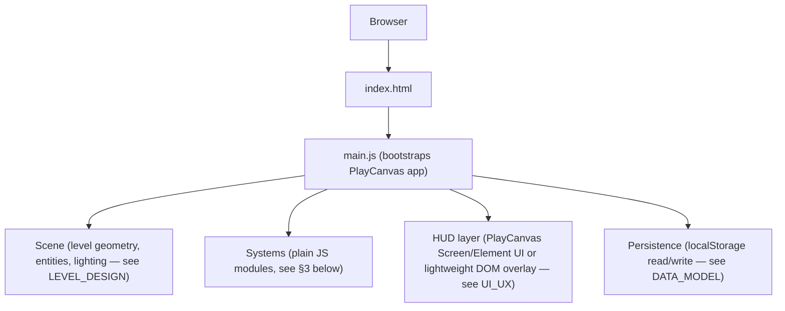
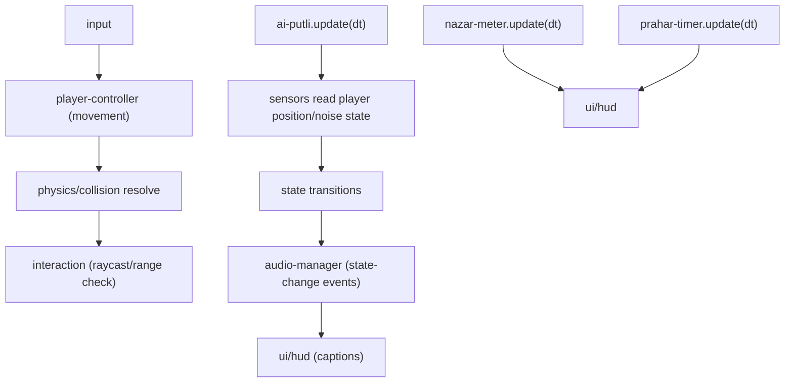

# ARCHITECTURE — KATPUTALI

Technical/code architecture. Complements [[TECH_STACK]] (what tools) with the module-level structure (how the code is organized). Coding conventions in [[CODING_RULES]].

## 1. System Overview

Fully client-side, single-page static web app. No backend, no server-side logic, no network calls at runtime beyond the initial static asset load (see [[SECURITY]] §2, [[TECH_STACK]] §5).



## 2. Project Structure

```
/src
  /core        — app bootstrap, PlayCanvas app setup, scene loading
  /systems     — gameplay systems: player-controller, ai-putli, inventory,
                 nazar-meter, prahar-timer, capture-struggle, interaction,
                 audio-manager, save-manager (see §3)
  /entities    — entity setup/config helpers (player, putli, interactables)
  /ui          — HUD, menus, settings screens (see UI_UX)
  /data        — static config: difficulty presets, item definitions,
                 room/route definitions, keybind defaults (see DATA_MODEL)
  /audio       — audio manifest/config (see AUDIO)
/assets
  /models /textures /audio /fonts   — see ASSETS for sourcing per subfolder
/public        — favicon, static passthrough files only (see M1 correction below)
index.html     — Vite's HTML entry point, project root (standard Vite convention)
```

**Correction (found post-M1, fixed after M6's HUD work):** `index.html` was originally placed in `/public` with `vite.config.js` set to `root: 'public'`. This built correctly (`vite build` resolves the entry's relative script path against the HTML file's location on disk) but silently broke `npm run dev` — the dev server resolves that same relative path against its URL namespace, which is anchored at `root`, so `/src/core/main.js` doesn't exist relative to `public/` and Vite's history-API fallback served `index.html` itself instead of the app, with no error, just wrong content. Moved `index.html` to the project root (the convention every other Vite project uses) and reverted `vite.config.js` to Vite's defaults (implicit `root: '.'`, `publicDir: 'public'`) — `/public` now holds only genuine static-passthrough files, verified working via `npm run dev` end-to-end.

## 3. Core Systems (module responsibilities)

| Module | Responsibility | Related doc |
|---|---|---|
| `player-controller` | Movement, crouch/sprint/stamina, camera, interact raycast | [[CONTROLS]], [[PHYSICS]] |
| `ai-putli` | Finite state machine (Idle/Patrol/Investigate/Chase/Search/Capture), sensors, navmesh pathing | [[AI_SYSTEM]] |
| `inventory` | Item slots, pickup/drop/combine logic | [[GAME_MECHANICS]] §2 |
| `interaction` | Contextual interact detection, dispatch to inventory/puzzle/read handlers | [[GAME_MECHANICS]] §1 |
| `capture-struggle` | Capture sequence, QTE input handling, respawn logic | [[GAME_MECHANICS]] §4 |
| `nazar-meter` | Fill/mitigate/penalty logic | [[GAME_MECHANICS]] §5 |
| `prahar-timer` | Countdown, penalty application, loss trigger | [[GAME_MECHANICS]] §6 |
| `audio-manager` | Positional/2D sound playback, mix rules, volume settings hookup | [[AUDIO]] |
| `save-manager` | `localStorage` read/write for settings + notes-found log | [[DATA_MODEL]] §2–3 |
| `ui/hud`, `ui/menus` | HUD rendering, menu screens, settings UI | [[UI_UX]] |

Each system is a small, independently testable JS module (see [[TESTING]] §2 for the Vitest unit-test boundary this enables) communicating through a lightweight event bus (e.g. simple pub/sub) rather than direct cross-module coupling — e.g. `ai-putli` emits a `putli:state-changed` event that `audio-manager` and `ui/hud` (for captions, see [[UI_UX]] §6) both subscribe to, instead of `ai-putli` calling into audio/UI code directly.

## 4. State Machine Pattern (shared convention)

Both `ai-putli` and `capture-struggle` use the same lightweight FSM pattern (explicit state enum + one `enter/update/exit` set per state) — documented once here and reused, per [[CODING_RULES]]'s "don't invent a second pattern for the same problem" rule. See [[AI_SYSTEM]] §8 for the Putli-specific instance.

## 5. Data Flow (per frame, high level)



Game logic runs on PlayCanvas's standard `update` tick; AI sensor evaluation is throttled to a lower frequency internally (see [[AI_SYSTEM]] §3, [[PERFORMANCE]] §4) rather than via a separate scheduler, to keep the architecture simple.

## 6. Level/Scene Loading

The entire haveli (all 13 rooms/floors, see [[LEVEL_DESIGN]]) loads as a single PlayCanvas scene at game start — no streaming, no level-of-detail scene swapping, since the whole space is small enough to fit comfortably within the performance budget (see [[PERFORMANCE]] §2). This is a deliberate simplicity choice for a solo-dev, single-location game.

## 7. Persistence Boundary

Only `save-manager` touches `localStorage`; no other module reads/writes it directly (keeps persistence format changes isolated to one file — see [[DATA_MODEL]] §2–3 for the schema it owns).

## 8. Build & Deploy Pipeline (summary — full detail in [[DEPLOYMENT]])

`Vite dev server` (local iteration) → `vite build` (production static bundle) → GitHub Actions CI → static host (GitHub Pages/Cloudflare Pages/itch.io). No server-side build step beyond this — see [[TECH_STACK]] §5.

## 9. Explicit Architectural Non-Goals

No client-server networking layer (single-player, see [[PRD]] §3), no ECS abstraction layer beyond what PlayCanvas already provides natively, no plugin/mod system, no save-file versioning/migration system (the persisted schema in [[DATA_MODEL]] §2–3 is intentionally tiny — settings + a notes log — so a future format change can simply reset it rather than needing migration logic).
