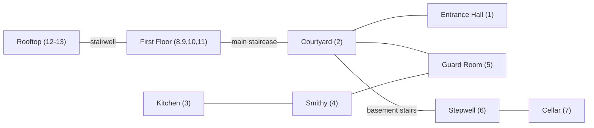

# LEVEL_DESIGN — KATPUTALI

Single-location layout: Haveli Kesar Mahal. This doc is the authoritative room list, connectivity, and puzzle-item placement — implementers should treat the tables below as the level's spec.

## 1. Design Principles

- **Hub-and-spoke, not corridor.** The central courtyard (*aangan*) is the hub; all three floors and all three escape routes are reachable from it without mandatory backtracking through a single choke point (avoids Putli camping a single corridor from softlocking a run).
- **Readable geography.** A player should be able to build a mental map within ~5 minutes; consistent architectural landmarks (courtyard fountain, staircase, distinct fresco colors per floor) aid orientation without needing a UI minimap (see [[GAMEPLAY]] §5).
- **Vertical compactness.** Basement + ground + first floor + rooftop = 4 levels, but the whole haveli footprint is small (see [[PERFORMANCE]] §2 for the resulting draw-distance/streaming implications — no level streaming needed, whole haveli fits in one loaded scene).
- **Every route touches multiple floors**, so exploring for one route naturally surfaces items useful for the others (see §5).

## 2. Floor Overview

| Floor | Key spaces | Primary route(s) served |
|---|---|---|
| Basement | Stepwell (*baori*), storage cellar | Baori route |
| Ground | Entrance hall, courtyard (hub), kitchen, smithy nook, guard room | Gate route (+ hub for all) |
| First floor | Bedrooms, library, family shrine, Sohni Bai's locked room | Lore, Gate & Rooftop route items |
| Rooftop | Open *chhat*, two *chhatris*, water tank | Rooftop route |

## 3. Room List

Each room includes size class (S/M/L, relative footprint for scale/perf planning — see [[PERFORMANCE]] §2), purpose, and notable contents.

### Ground Floor
| # | Room | Size | Purpose | Contents |
|---|---|---|---|---|
| 1 | Entrance Hall / Deodhi | M | Start point, Gate escape point | Barred front gate, key-fragment socket, tutorial prompts |
| 2 | Central Courtyard (Aangan) | L | Hub, Putli's home patrol loop, capture-cage location | Fountain, puppet-stage cage, main staircase, 4 pillar hiding spots |
| 3 | Kitchen | S | Item source | Loose floor tile (noise trap), 1 key fragment |
| 4 | Smithy Nook | S | Gate puzzle station | Key-reassembly workbench |
| 5 | Guard Room | S | Item source, hiding spot | *Almirah* hiding spot, ward item (kalava thread) |

### Basement
| # | Room | Size | Purpose | Contents |
|---|---|---|---|---|
| 6 | Stepwell (Baori) | L | Baori puzzle station & escape point | Pulley mechanism, tunnel grate, water-level puzzle |
| 7 | Storage Cellar | M | Item source, dark/tense | Oil torch, 1 pulley part, child's-shoe lore prop |

### First Floor
| # | Room | Size | Purpose | Contents |
|---|---|---|---|---|
| 8 | Meera's Old Bedroom | S | Item source | 1 diary note, rope (rooftop item) |
| 9 | Sohni Bai's Locked Room | S | High-Nazar room, lore | 3 diary notes, ward item (neem bundle), requires a found room-key |
| 10 | Library | M | Fresco-clue puzzle room | Fresco diya-pattern clue, troupe poster prop, 1 key fragment |
| 11 | Family Shrine | S | Ward item source, hiding spot | *Jaali* screen hiding spot, ward item (neem bundle), 1 diary note |

### Rooftop
| # | Room | Size | Purpose | Contents |
|---|---|---|---|---|
| 12 | Open Chhat | M | Traversal, patrol extension | Water tank (noise trap when climbed past) |
| 13 | Zipline Chhatri | S | Rooftop puzzle station & escape point | Zipline rig point, needs rope+hook+counterweight |

**Total: 13 distinct rooms/spaces** across 4 floors — small enough for a single art/lighting pass per [[ASSETS]] and [[PERFORMANCE]] budgets, large enough to support 20–35 minutes of exploration per [[GAMEPLAY]] §1.

## 4. Connectivity (textual graph)

Courtyard (Room 2) is the only room with direct access to all four branches (entrance, ground-floor wing, basement stairs, main staircase up) — reinforcing its role as Putli's default patrol anchor (see [[AI_SYSTEM]] §5).

## 5. Escape Route Puzzle Chains

| Route | Steps | Items required | End interaction |
|---|---|---|---|
| **Gate** | (a) Collect 3 key fragments (Kitchen, Guard Room via a locked drawer, Library) → (b) reassemble at Smithy workbench → (c) unlock & open front gate | 3× key fragment | Interact at Room 1 gate |
| **Baori** | (a) Collect 3 pulley parts (Cellar, Stepwell alcove, a Courtyard pillar niche) → (b) repair pulley at Stepwell → (c) light oil torch (found in Cellar, lit at any wall sconce) → (d) lower grate/open tunnel | 3× pulley part, 1× oil torch | Interact at Room 6 tunnel grate |
| **Rooftop** | (a) Find rope (Meera's Bedroom), hook (Guard Room), counterweight (Library, alt. of the fresco puzzle reward) → (b) rig zipline at Chhatri → (c) launch | 1× rope, 1× hook, 1× counterweight | Interact at Room 13 launch point |

All three chains are solvable independently and in any order; no chain requires an item from another chain (see [[GAME_MECHANICS]] §2). The Library's fresco diya-pattern puzzle is a stand-alone lock puzzle (light 5 diyas in the sequence shown in a fresco) gating the room's key fragment/counterweight, not a separate fourth route.

## 6. Lore & Ward Item Placement

- **6 diary notes** total: 1 in Meera's Bedroom, 3 in Sohni Bai's Locked Room, 1 in Library, 1 in Family Shrine — matches the "6 notes" completionist stat in [[UI_UX]] and [[SCENARIO]] §7.
- **3 ward items** total (2 neem bundles, 1 kalava thread) placed in Guard Room, Family Shrine, and Sohni Bai's Locked Room — deliberately placed near the highest-Nazar rooms so the player earns mitigation near the pressure that requires it.

## 7. Hiding Spots

Fixed set of 7: 4 courtyard pillars (Room 2), Guard Room almirah (Room 5), Family Shrine jaali screen (Room 11), Stepwell alcove (Room 6). Distribution ensures every floor has at least one hiding spot reachable within a short sprint of any point on that floor (validated per [[TESTING]] §4).

## 8. Putli's Patrol Routes

Three overlapping patrol loops anchored on the Courtyard, extending to Ground floor wing, First floor, and Basement respectively, with weighted random selection between loops at each patrol-loop completion — full behavioral logic in [[AI_SYSTEM]] §5. Level geometry (door widths, stair layout) must accommodate Putli's navmesh agent radius — see [[PHYSICS]] §2 and [[AI_SYSTEM]] §8 for the technical constraint this places on room 2/6/10 doorway sizing.

## 9. Out of Scope

No procedural room generation, no additional floors/wings, no outdoor village area beyond the rooftop view (skybox only — see [[ASSETS]] §3), no destructible geometry.
