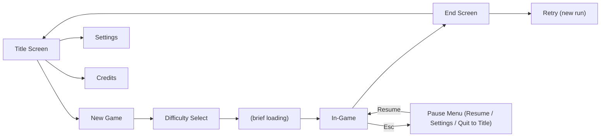

# UI_UX — KATPUTALI

Screens, HUD, and accessibility spec. Visual style follows [[ASSETS]] §4 (Rajasthani miniature-painting palette); input bindings referenced here are defined in [[CONTROLS]].

## 1. Screen Flow

No save-slot selection screen (single always-fresh run per [[PRD]] §5.10) — "Continue" is not a menu option; only "New Game." Single-player, single-controller/keyboard focus — no player-select screen (see [[CONTROLS]] §2).

## 2. In-Game HUD

Minimal, corner-anchored, semi-diegetic styling (aged-paper/miniature-painting-frame texture rather than flat modern UI chrome — see [[ASSETS]] §4):

| Element | Position | Shows |
|---|---|---|
| Prahar clock | Top-right | Stylized burning-oil-lamp/moon-phase icon + current Prahar number + countdown, per [[GAME_MECHANICS]] §6 |
| Capture pips | Top-right, below clock | 3 pips (e.g. small puppet-string icons), fill/darken per capture, per [[GAME_MECHANICS]] §4 |
| Nazar meter | Top-left | Small radial/bar meter (evil-eye motif), per [[GAME_MECHANICS]] §5 |
| Inventory bar | Bottom-center | 5 slots, current items, selected item highlighted, per [[GAME_MECHANICS]] §2 |
| Interact prompt | Center, contextual | Icon/key glyph + short verb ("Pick up", "Combine", "Read"), only visible in interact range, per [[GAME_MECHANICS]] §1 |
| Struggle QTE overlay | Center, only during capture | Alternating input prompts, per [[GAME_MECHANICS]] §4 |

No permanent objective marker, waypoint arrow, or minimap — deliberate, see [[GAMEPLAY]] §5. No numeric health bar — capture pips are the only failure-resource display, consistent with the Granny-inspired design pillar in [[GDD]] §2.

## 3. Interact Prompts & Notes

- Interact prompts fade in/out based on range and line of sight (see [[GAME_MECHANICS]] §1) — never persistent clutter.
- Reading a note opens a non-pausing (game/AI keep running — tension-preserving) translucent text overlay, dismissed with Interact or Esc; note text is short (see [[STORY]] §4 word-count budget).

## 4. Settings Screen

- **Audio:** Master / Music / SFX volume sliders (see [[AUDIO]] §5).
- **Controls:** Mouse sensitivity, key/gamepad rebinding (see [[CONTROLS]] §3), invert-Y toggle.
- **Accessibility:** Subtitle/caption toggle for critical audio cues, colorblind-safe HUD accent toggle, motion/camera-shake intensity slider (jump-scare/chase camera effects reduced, not removed, to preserve tension while respecting sensitivity — see §6).
- **Difficulty:** Read-only display of current run's difficulty (changeable only from the pre-game Difficulty Select screen, per [[GAME_MECHANICS]] §3, to keep a session internally consistent).

All settings persist via `localStorage` — see [[DATA_MODEL]] §3.

## 5. End Screen

Reports: ending name (Gate / Baori / Rooftop / Bound — see [[STORY]] §5), Prahars elapsed, captures taken (x/3), notes found (x/6, see [[LEVEL_DESIGN]] §6). No score, no leaderboard, no share/social integration (see [[PRD]] §10, [[SECURITY]]). Buttons: Retry, Title Screen.

## 6. Accessibility Baseline (see [[PRD]] §6 for the requirement source)

- Full rebinding (§4 above).
- Subtitles/captions for: Putli proximity audio tell, capture event, Nazar hallucination trigger, ending narration text (if any) — this is the accessibility justification for [[AI_SYSTEM]] §7's "every state has an audio tell" rule, since the tell must also be representable as text/visual for players who can't rely on audio.
- Colorblind-safe accent option for HUD elements that use color-coding (Nazar meter, capture pips) — verified against Deuteranopia/Protanopia/Tritanopia simulation before ship (see [[TESTING]] §5).
- Adjustable camera shake / effect intensity, never fully absent (some visual feedback must remain for the deaf/hard-of-hearing caption path to make sense) but reducible for motion sensitivity.
- Text sizing follows a single accessible minimum (no separate "small/large" toggle needed given the low text volume — see [[STORY]] §4).

## 7. Visual Style Notes

HUD iconography and fonts pull from the same curated Rajasthani-miniature-inspired palette and free Devanagari-influenced display font (headers only, body text stays in a highly legible free sans-serif for readability) defined in [[ASSETS]] §4 — no generic default-engine UI skin ships in the final build.

## 8. Out of Scope

No in-game achievements UI, no social share cards, no analytics-driven UI experiments, no multi-language localization UI (English only, see [[PRD]] §10), no on-screen virtual controls (desktop only, see [[CONTROLS]] §5).
